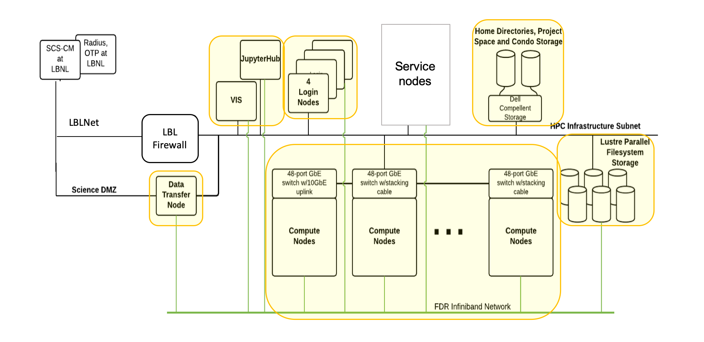
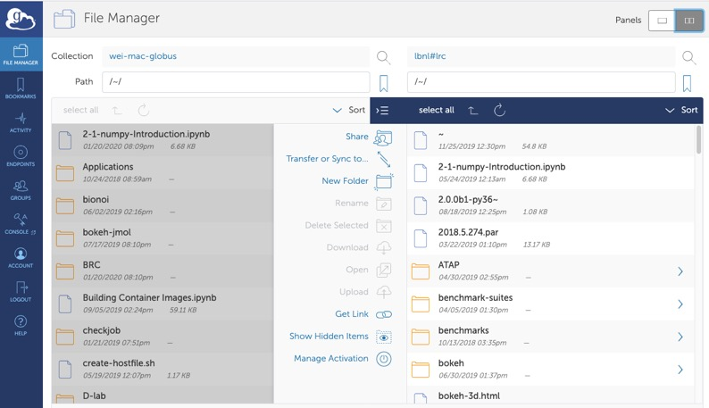

% Lawrencium 101 
% February 11, 2021
% Wei Feinstein

# Outline

- Orientation of Lawrencium supercluster
- Access/login to clusters
- Access software on the system
- Data transfer to/from clusters
- Job submission and monitoring
- Open Ondemand with Jupyter notebooks
- Remote visualization  


# Lawrencium Cluster Overview

- A computing service provided by the IT Division to support researchers in all disciplines at the Lab
- Help the scientists solve various problems  that positively impact the world.  
- Lawrencium is a LBNL Condo Cluster Computing program
  - Significant investment from LBNL
  - Individual PIs purchasing nodes and storage
  - Computational cycles are shared among all lawrencium users


# System Capabilities

- IT Division & Condo Contributions
  - 1058 Compute nodes
  - 30,192 CPUs
  - 150 GPUs
  - 712 User Accounts
  - 317 Groups 

- Standalone Clusters
  - UC Berkeley  
  - Advanced Light Source   
  - Nuclear Science Division   
  - Applied Nuclear Physics
  - Biological Systems Engineer Division


# Conceptual diagram of Lawrencium

<left></left>

[Detailed informaton of Lawrencium](https://sites.google.com/a/lbl.gov/high-performance-computing-services-group/lbnl-supercluster/lawrencium)


# Getting Access to Lawrencium

### Three types of Project Accounts

- Primary Investigator (PI) Computing Allowance (PCA) account: free 300K SUs per year (pc_xxx)
- Condo account: PIs can purchage compute nodes to be added to the general pool, in exchage for their own priority access and share the Lawrencium infrastructure (lr_xxx)
- Recharge account: pay as you go with minimal recharge rate ~ $0.01/SU (ac_xxx)
- [Details](http://scs.lbl.gov/getting-an-account) 
- PIs can add researchers/students working with them to get user accounts with access to the PCA/condo/recharge resources available to them
  - User account [request](http://scs.lbl.gov/getting-an-account)
  - User agreement [consent](http://scs.lbl.gov/getting-an-account)

### Login to Lawrencium Cluster

- Linux terminal (command-line) session. 
- Mac terminal (see Applications -> Utilities -> Terminal). 
- Windows [PuTTY](https://www.chiark.greenend.org.uk/~sgtatham/putty/latest.html).
- One-time passwords (OPT): set up your smartphone or tablet with Google Authenticator 
- Login:
```
ssh $USER@lrc-login.lbl.gov
```
- Followed by password prompt 
```
$ password:
```
- Enter your PIN followed by the one-time password from which your Google Authenticator app generates on your phone / tablet.
- **DO NOT run jobs on login nodes!!**


# User Space
 
- Home: 10GB per user, backed up
`/global/home/users/$USER/`
- Global scratch: shared, no backup, where to launch jobs
`/global/scratch/$USER/`
- shared group space
`/global/home/groups-sw/  /global/home/group/`
- Condo storage 
`e.g. /clusterfs/etna/`


# Data Transfer 

### scp/rsync on lrc-xfer.lbl.gov (DTN)
```
# On local machine transfer to Lawrencium
scp file-xxx $USER@lrc-xfer.lbl.gov:/global/home/users/$USER
scp -r dir-xxx $USER@lrc-xfer.lbl.gov:/global/scratch/$USER

# On Local machine transfer from Lawrencium
scp $USER@lrc-xfer.lbl.gov:/global/scratch/$USER/file-xxx ~/Desktop

# Transfer from Lawrencium to Another Institute
ssh $USER@lrc-xfer.lbl.gov
scp -r file-on-lawrencium $USER@other-institute:/destination/path/$USER
```
- On Window
  - [WinSCP](https://winscp.net/eng/index.php)
  - [FileZella](https://filezilla-project.org/): multi-platform program via SFTP

### Data Transfer using Globus

- Transfer data faster and unattended between endpoints, see [instructions](https://sites.google.com/a/lbl.gov/high-performance-computing-services-group/getting-started/data-transfer)
- Possible endpoints include: lbnl#lrc, your laptop/desktop, NERSC, among others.
- Transfer data to/from your laptop (endpoint setup):
 - Globus Connect Personal [set up](https://www.globus.org/globus-connect-personal)
 - Your machine established as an endpoint
 - Globus Connect Pesonal actively running on your machine. 

<left></left>


# Softwre Module Farm 

### Module commands

- Suite of software packages are available to user, e.g. compiler, libs...
- Module is used to manage user environment to avoid clashes between incompatible software 
```  
module purge: clear user’s work environment
module avail: check available software packages
module load xxx*: load a package
module list: check currently loaded software 
```
- Modules are arranged in a hierarchical fashion, some of the modules become available only after you load the parent module (e.g., MKL, FFT, and HDF5/NetCDF software is nested within the gcc module). 
- Here's how to load MPI as an example
```
module load intel/2016.4.072
module av
module load mkl/2016.4.072 openmpi/3.0.1-intel
```
- Learn more [environment modules](https://sites.google.com/a/lbl.gov/high-performance-computing-services-group/getting-started/sl6-module-farm-guide)
- Users are allowed to install software in their home or group space


# Install Python Modules 

- Users don't have admin rights, most software can be installed  --prefix=/dir/to/your/path
- Python modules: abundantly available but cannot be installed in the default location without admin rights.
```
[wfeinstein@n0000 ~]$ module available python
--------------------- /global/software/sl-7.x86_64/modfiles/langs -----------------------------------
python/2.7          python/3.5          python/3.6(default) python/3.7          python/3.7.6        python/3.8.2-dll
```
- pip install --user package_name: 
- pip install --install-option="--prefix=$HOME/local" package_name
- python setup.py install –home=/home/user/package_dir
- export PYTHONPATH=


# SLURM: Resource Manager & Job Scheduler

### Overview

All computations are done by submitting jobs to the scheduling software that manages jobs on the cluster, called SLURM.
SLURM is the resource manager and job scheduler to managing jobs on cluster

Why is this necessary? Otherwise your jobs would be slowed down by other people's jobs running on the same node. This also allows everyone to fairly share Savio.

The basic workflow is:

  - login to Lawrencium; you'll end up on one of the login nodes in your home directory
  - cd to the directory from which you want to submit the job
  - submit the job using sbatch (or an interactive job using srun, discussed later)
  - when your job starts, the working directory will be the one from which the job was submitted
  - the job will be running on a compute node, not the login node 

### Jub Submission

#### Accounts, Partitions, QOS
 
- Check slurm association, such as qos, account, partition

`sacctmgr show association user=wfeinstein -p`

```
perceus-00|ac_test|wfeinstein|lr6|1||||||||||||lr_debug,lr_lowprio,lr_normal|||
perceus-00|ac_test|wfeinstein|lr5|1||||||||||||lr_debug,lr_lowprio,lr_normal|||
perceus-00|pc_test|wfeinstein|lr4|1||||||||||||lr_debug,lr_lowprio,lr_normal|||
perceus-00|lr_test|wfeinstein|lr3|1||||||||||||lr_debug,lr_lowprio,lr_normal,te
perceus-00|scs|wfeinstein|es1|1||||||||||||es_debug,es_lowprio,es_normal|||
```

#### Submit Jobs, Request Compute Nodes

- Get help with the complete command options
`sbatch --help`
- sbatch: submit a job to the batch queue system
`sbatch myjob.sh`
- srun: request an interactive node(s) and login automatically
`srun -A ac_xxx -N 1 -p lr5 -q lr_normal -t 1:0:0 --pty bash`
- salloc : request an interactive GPU node(s)
`salloc --account=pc_xxx --nodes=1 --partition=es1 --gres=gpu:1 --ntasks=2 --qos=es_normal –t 0:30:0`
- More flags
  - Specify node type --constrain (-C)
  - Memeory contrain for shared cluster: --memory


# Submitting a Batch Job 

Job Submission Script Example

```
#!/bin/bash -l
#SBATCH --job-name=container-test
#SBATCH --partition=lr5
#SBATCH --account=ac_xxx
#SBATCH --qos=lr_normal
#SBATCH --nodes=1
#SBATCH -
````

# Monitoring Jobs

- sinfo: check status of partitions and nodes (idle, allocated, drain, down) 
`sinfo –r –p lr6`
- squeue: check jobs in the batch queuing system (R or PD)
`squeue –u $USER`
- sacct: check job information or history
`sacct -X -o 'jobid,user,partition,nodelist,stat'`
- scancel : cancel a job
`scancel jobID`

More information of [slurm usage](https://sites.google.com/a/lbl.gov/high-performance-computing-services-group/scheduler/slurm-usage-instructions)


# Open Ondemand 

- Single web point of entry to Lawrencium supercluster
- Allow access to Lawrencium compute resources 
- Supercomputer access 					
  - File browser: file editing, data transfer
  - Shell command line access - terminal
- Monitor jobs
- Interactive applications: Jupyter notebooks, MatLab, RStudio...
  - Two partitions, 4 CPU nodes and 1 GPU node, for exploration
  - Access to all Lawrencium partitions for computing jobs
- Sever: [https://lrc-ondemand.lbl.gov/](https://lrc-ondemand.lbl.gov/)
  - Intel Xeon Gold processor with 32 cores, 96 GB RAM

# Open Ondemnd One-Minute Demo Using Jupyter Notebooks

[https://lrc-ondemand.lbl.gov/](https://lrc-ondemand.lbl.gov/)
 

# Remote Visulization 

- Allow users to run a real desktop within the cluster environment 
- Allow applications with a GUI, commercial applications, debugger or visualization applications to render results. 
- Allows users to disconnect/resume from anywhere without losing the work. 
- RealVNC is provided as the remote desktop service, steps:
  - Login to viz node (lrc-viz.lbl.gov)
  - Start VNC service on viz node
  - Start applications: Firefox, Jupyter notebooks, paraview ...
  - Shut it down properly to release resource for other users (logout). Simply close the VNC Viewer does not clean the resource on the server
- Detailed [instructions](https://sites.google.com/a/lbl.gov/high-performance-computing-services-group/getting-started/remote-desktop)


# Getting help

- Virtual Office Hours:
    - Time: 10:30am - noon (Wednesdays)
    - Online [request](https://docs.google.com/forms/d/e/1FAIpQLScBbNcr0CbhWs8oyrQ0pKLmLObQMFmYseHtrvyLfOAoIInyVA/viewform)
- Sending us tickets at hpcshelp@lbl.gov
- More information, documents, tips of how to use LBNL Supercluster [http://scs.lbl.gov/](http://scs.lbl.gov)

To improve our HPC traing and services, please fill out [Training Survey](https://docs.google.com/forms/d/e/1FAIpQLSdrmW-7gZ8FankQwEceY6r_uXPmLHAuXFjDDfwu-86A1a0llg/viewform)


# Hands-on Exercise

- 1) Login  
- 2) Data transfer
- 3) Module load
- 4) Install python modules
- 5) Submit jobs


# Login and Data Transfer

Objective: transfer data to/from LRC 

1) Download test data [here](  ) 

2) Open two linux terminals on Mac or Window via Putty 

3) Transfer local data.sample to LRC on terminal 1 
```
scp -r data.sample $USER@lrc-xfer.lbl.gov:/global/home/users/$USER 
scp -r data.sample $USER@lrc-xfer.lbl.gov:~
``` 
4) On terminal 2, login to LRC
``` 
ssh $USER@lrc-login.lbl.gov 
pwd 
cat data.sample
cp data.sample data.bak
``` 
5) Transfer data from LRC to your local machine on terminal 1
```
scp -r $USER@lrc-xfer.lbl.gov:/global/home/users/$USER/data.bak .
ls data.*
```

# Modules

- Display software packages on LRC
` module available`
- Check modules in your env
` module list`
- Clear your env
` module purge`
- Load a module
```
 module load intel/2016.4.072
 module list
 module av
```


